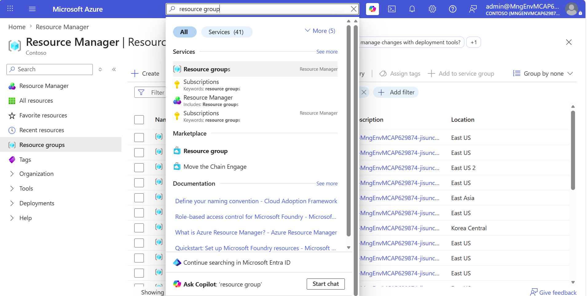
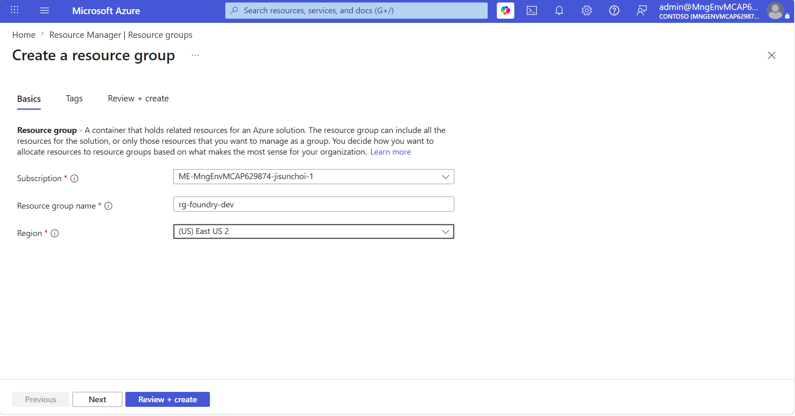
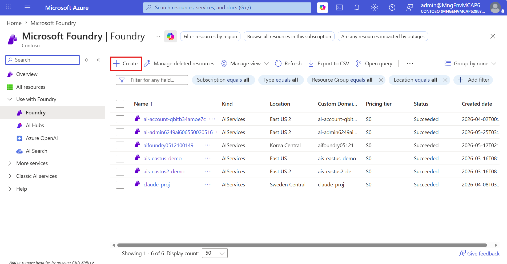
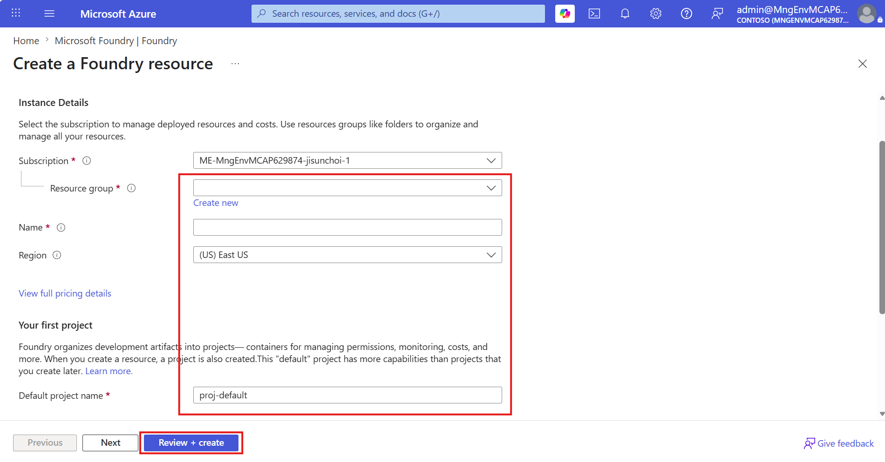
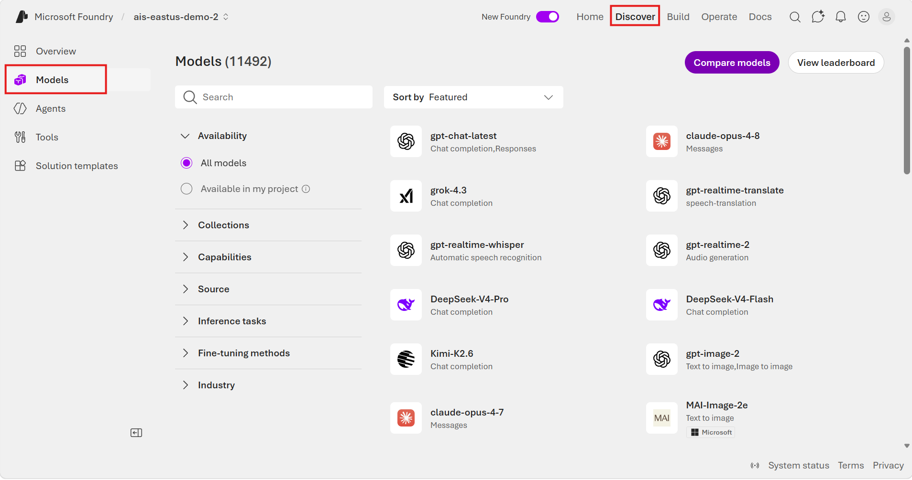
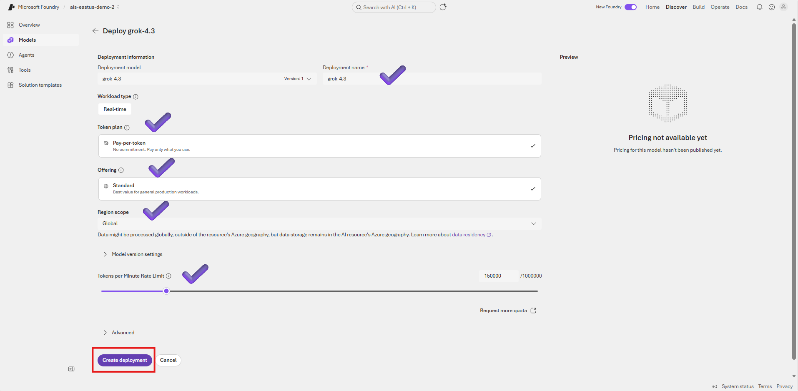
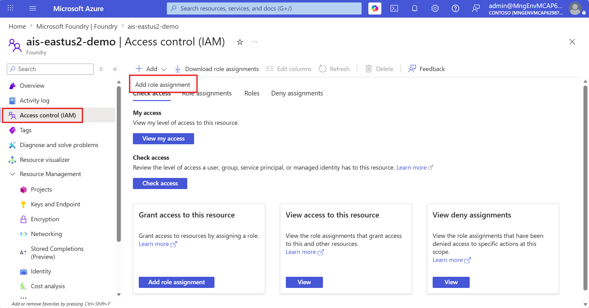
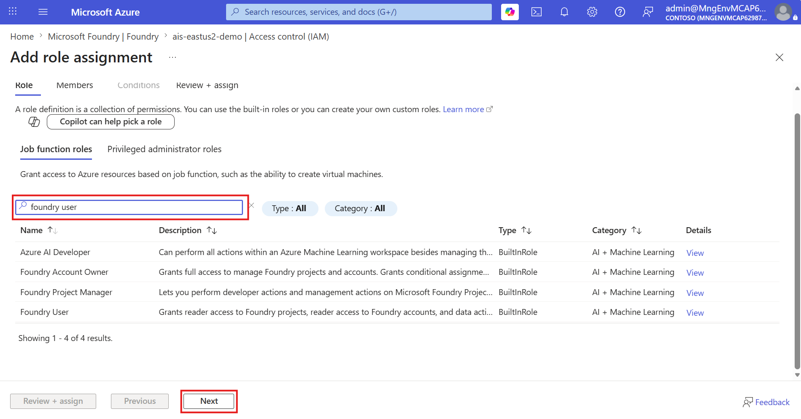
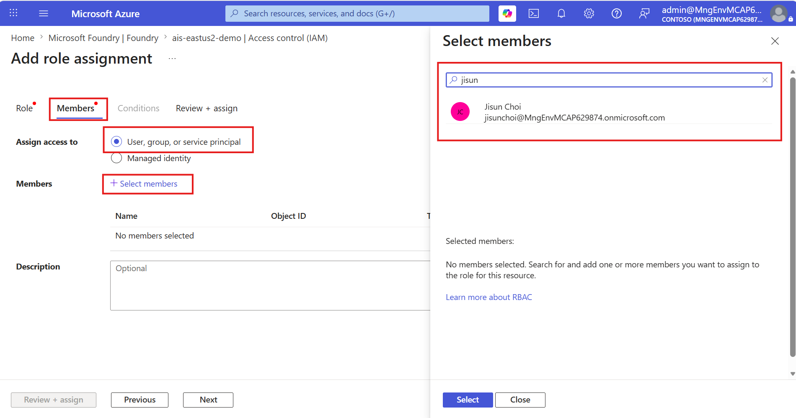

# 01. Entra ID + Foundry Setup (Portal)

Using the Azure Portal and the Foundry portal, configure a Resource Group, Foundry resource, model deployment, and RBAC permissions in order.

## Steps

- Check prerequisites
- Create a Resource Group
- Create a Foundry resource and default project
- Deploy a model
- Choose a deployment type
- Grant Entra ID permissions to developers

## Prerequisites

- **Azure subscription**: A [free account](https://azure.microsoft.com/free/) or a corporate subscription
- **Permissions**: To create resources you need **Owner** or **Contributor** on the subscription/resource group
- **Model access**: Some models (e.g., the GPT-4 family) have different availability by region and subscription

## Step 1 — Create a Resource Group

A Resource Group is a container that logically groups Azure resources. In customer environments, we recommend a flow that **creates the resource group first** to make cost tracking, permissions, policies, and deletion scope explicit.

1. Sign in to the [Azure Portal (`https://portal.azure.com`)](https://portal.azure.com).
2. Search for **Resource groups** in the top search bar.
3. Click **+ Create**.

4. Enter the following values.

   | Field | Example |
   |---|---|
   | Subscription | Customer subscription |
   | Resource group | `rg-foundry-dev` |
   | Region | `eastus2` or a region where the model is available |

5. Click **Review + create → Create**.

## Step 2 — Create a Foundry resource and default project

In this step you create a **Foundry resource** inside the Resource Group you just made, and create a default project along with it.

1. In the Azure Portal or the Foundry portal, search for **Microsoft Foundry**.
2. Click **Create a Foundry Resource** or **Create**.

3. Enter the following values.

   | Field | Example |
   |---|---|
   | Resource group | `rg-foundry-dev` |
   | Name | `foundry-<unique-name>` |
   | Location | Same region as the Resource Group, or a region where the model is available |
   | Default project name | `proj-default` |

4. Click **Review + create → Create**.

When creation finishes, click **Go to Foundry portal** on the Foundry resource overview to move to the project.

## Step 3 — Deploy a model

1. In the top-right menu of the project → **Discover** → **Models**.

2. Select a model from the model catalog (e.g., `gpt-4o`).
3. Configure the following:
   - **Deployment name**: The name you'll use when calling the API (e.g., `my-gpt4o-prod`)
   - **Deployment type**: See the [Reference - Deployment types](#reference--choosing-a-deployment-type) table
   - (Optional) **Content filter**, **TPM (tokens per minute) limit**
4. Click **Create deployment**.

> When calling the API you use the **deployment name, not the model name**. Be sure to record the deployment name.

## Reference — Choosing a deployment type

Foundry deployments are broadly divided into **pay-as-you-go (Standard)** and **provisioned capacity (Provisioned/PTU)**, each with global / data zone / regional variants.

| Deployment type | SKU code | Data processing location | Billing | Best for |
|-----------|----------|------------------|------|-------------|
| **Global Standard** | `GlobalStandard` | All Azure regions | Pay-as-you-go per token | **Getting started / general workloads (most recommended, largest quota)** |
| Global Provisioned (PTU) | `GlobalProvisionedManaged` | All Azure regions | PTU reservation | Predictable high load, low and consistent latency |
| **Global Batch** | `GlobalBatch` | All Azure regions | **50% discount** (24h target) | Non-real-time, large-volume async jobs |
| Data Zone Standard | `DataZoneStandard` | Within a data zone (US/EU) | Pay-as-you-go | EU/US data zone compliance |
| Data Zone Provisioned | `DataZoneProvisionedManaged` | Within a data zone | PTU reservation | Data zone + consistent throughput |
| Standard | `Standard` | Single region | Pay-as-you-go | Regional compliance, low volume |
| Regional Provisioned | `ProvisionedManaged` | Single region | PTU reservation | Regional compliance + throughput |
| Developer | `DeveloperTier` | All regions | Pay-as-you-go | **Evaluation-only** for fine-tuned models (no SLA, 24h lifetime) |

**Recommended for customers starting out**: Begin with `GlobalStandard` → move to `PTU` as traffic grows and latency matters → split large-volume async work to `GlobalBatch`.

**Data residency**: Stored data always stays in your chosen region; only the **inference data** path differs by type (Global = all regions / Data Zone = US or EU zone / Standard·Regional = the deployment region).

> To allow only specific deployment types at the organization level, you can restrict `Microsoft.CognitiveServices/accounts/deployments/sku.name` with **Azure Policy**.

## Step 5 — Grant Entra ID permissions to developers

Instead of an API Key, assign an Entra ID role (RBAC).

1. In the Azure Portal, go to the **Foundry resource** (or project) → **Access control (IAM)**.

2. Click **+ Add → Add role assignment**.
3. Select the **Foundry User** role (least privilege) → **Next**.

4. In **+ Select members**, choose the developer account/group → **Review + assign**.

### Microsoft Foundry roles

| Role | Permission | Audience |
|------|------|------|
| **Foundry User** (formerly Azure AI User) | **Calls** models/agents in a project (least privilege) | Developers |
| **Foundry Project Manager** | Manages projects + grants the User role + publishes agents | Team leads |
| **Foundry Account Owner** | Creates accounts/projects, manages models, assigns roles | Managers |
| **Foundry Owner** | Full management + build (highest privilege) | — |

## Next steps

[02. API Calls](02-api-calls.md) — Call the model with a key or Entra ID.

> To automate the same setup with a script → [01. Setup (CLI)](01-setup-cli.md)

## Reference docs

- [Quickstart: Build with models and agents](https://learn.microsoft.com/en-us/azure/ai-foundry/quickstarts/get-started-code)
- [Create and deploy an Azure OpenAI resource](https://learn.microsoft.com/en-us/azure/ai-foundry/openai/how-to/create-resource)
- [Understanding deployment types in Foundry Models](https://learn.microsoft.com/en-us/azure/ai-foundry/foundry-models/concepts/deployment-types)
- [RBAC for Microsoft Foundry](https://learn.microsoft.com/en-us/azure/ai-foundry/concepts/rbac-azure-ai-foundry)
- [Plan a Foundry rollout](https://learn.microsoft.com/en-us/azure/ai-foundry/concepts/planning)
