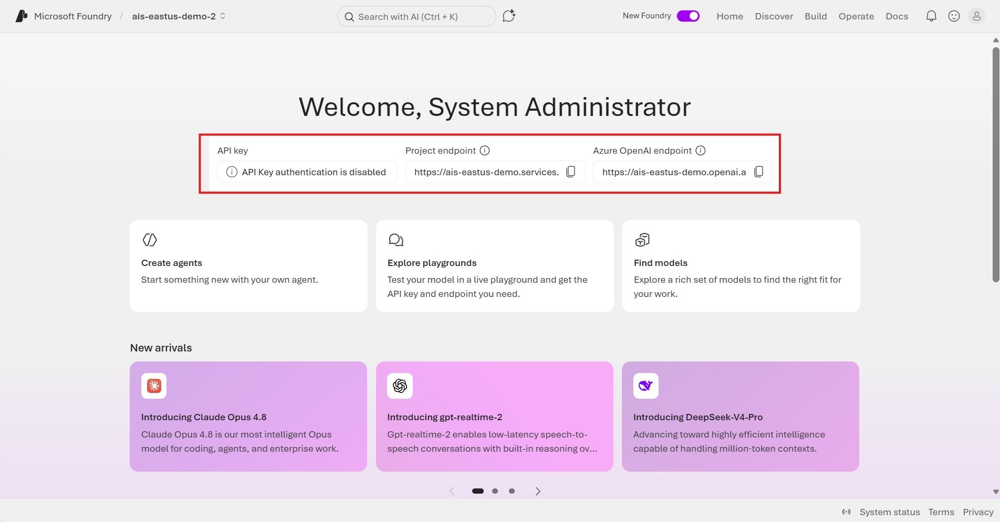

# 02. API Calls

Call a model you deployed in Foundry using both the API Key and Microsoft Entra ID methods. The examples are based on the **Responses API**, the recommended approach for new development.

## What this document covers

- Installing the common Python package and setting environment variables
- Calling with the API Key method
- Keyless calling based on Microsoft Entra ID
- The `DefaultAzureCredential` authentication flow

> **Support check**: The Responses API requires the `v1` API path, and support varies by region and model. Before deploying, verify supported regions and models in the [official Azure OpenAI Responses API docs](https://learn.microsoft.com/en-us/azure/ai-foundry/openai/how-to/responses).

## 1. Authentication methods

- **API Key**: The simplest, so it's well suited to quick tests/PoCs. However, a single key carries full permissions, so it's risky if leaked and cannot apply role-based restrictions.
- **Microsoft Entra ID (keyless)**: Recommended for production because it enables fine-grained RBAC, requires no key storage, and supports Managed Identity. Initial setup takes one extra step.

> Microsoft's official recommendation: *"Key-based authentication grants full access through the key, so it has no role restrictions. For security and fine-grained access control, we recommend Entra ID authentication."*



## 2. Installation

```bash
pip install openai azure-identity
```

Set the common environment variables (Bash):

```bash
export AZURE_OPENAI_ENDPOINT="https://<resource-name>.openai.azure.com/openai/v1/"
export AZURE_OPENAI_DEPLOYMENT="my-gpt4o-prod"  # Deployment name (not the model name)
```

## 3. API Key method

Set the environment variable (Bash):

```bash
export AZURE_OPENAI_API_KEY="<your-api-key>"
```

```python
import os
from openai import OpenAI

client = OpenAI(
    api_key=os.getenv("AZURE_OPENAI_API_KEY"),
    base_url=os.getenv("AZURE_OPENAI_ENDPOINT"),
)

resp = client.responses.create(
    model=os.getenv("AZURE_OPENAI_DEPLOYMENT"),
    input="Hello! Please describe Azure Foundry in one sentence.",
)
print(resp.output_text)
```

> Don't hardcode keys in code/git. Use environment variables or [Azure Key Vault](https://learn.microsoft.com/en-us/azure/key-vault/general/overview).

## 4. Entra ID (keyless) method — recommended for production

As long as the developer runs `az login` beforehand, `DefaultAzureCredential` fetches the token automatically.

Bash:

```bash
az login

export AZURE_OPENAI_ENDPOINT="https://<resource-name>.openai.azure.com/openai/v1/"
export AZURE_OPENAI_DEPLOYMENT="my-gpt4o-prod"
```

```python
import os
from azure.identity import DefaultAzureCredential, get_bearer_token_provider
from openai import OpenAI

token_provider = get_bearer_token_provider(
    DefaultAzureCredential(),
    "https://ai.azure.com/.default",     # Foundry token scope
)

client = OpenAI(
    base_url=os.getenv("AZURE_OPENAI_ENDPOINT"),
    api_key=token_provider,               # Pass the token provider
)

resp = client.responses.create(
    model=os.getenv("AZURE_OPENAI_DEPLOYMENT"),
    input="Hello! Please describe Azure Foundry in one sentence.",
)
print(resp.output_text)
```

### How `DefaultAzureCredential` works

It attempts credentials in the following order.

1. Environment variables (service principal)
2. **Managed Identity** — when running on an Azure VM/Functions/App Service
3. **Azure CLI login** (`az login`) — for local development
4. VS Code, Azure Developer CLI, etc.

→ **`az login` locally and Managed Identity in production (Azure)** are applied automatically, so the code works identically without changes.

## Next steps

Once direct calls from your app work, check whether the same Foundry deployment can also be used from developer tools in **[03. Calling Foundry Models from Copilot](03-copilot-foundry-integration.md)**.


## Reference docs

- [Azure OpenAI Responses API](https://learn.microsoft.com/en-us/azure/ai-foundry/openai/how-to/responses)
- [Switch between OpenAI and Azure OpenAI endpoints](https://learn.microsoft.com/en-us/azure/ai-foundry/openai/how-to/switching-endpoints)
- [Entra ID / managed identity authentication](https://learn.microsoft.com/en-us/azure/ai-foundry/openai/how-to/managed-identity)
- [Quickstart: Build with models and agents](https://learn.microsoft.com/en-us/azure/ai-foundry/quickstarts/get-started-code)
- [DefaultAzureCredential overview](https://learn.microsoft.com/en-us/azure/developer/python/sdk/authentication/credential-chains)
- [Azure Key Vault overview](https://learn.microsoft.com/en-us/azure/key-vault/general/overview)
