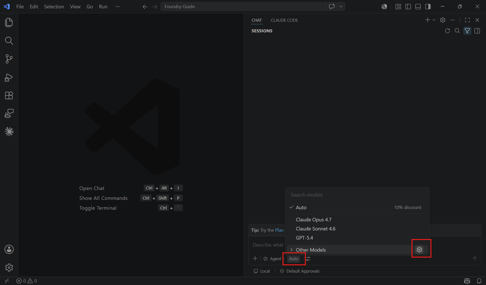
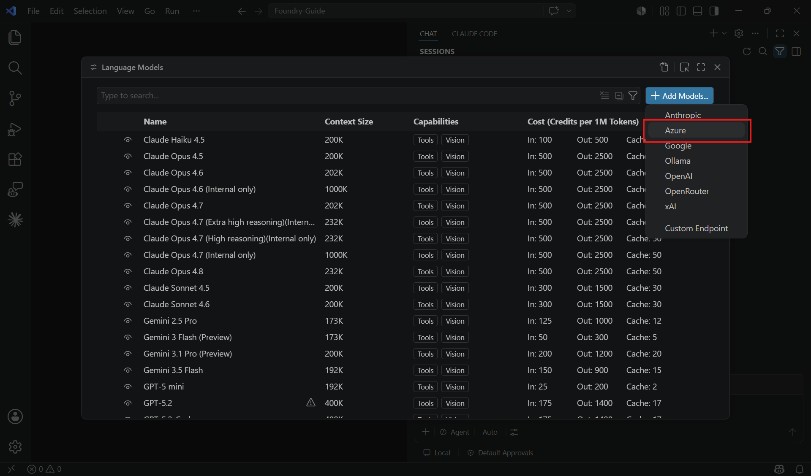
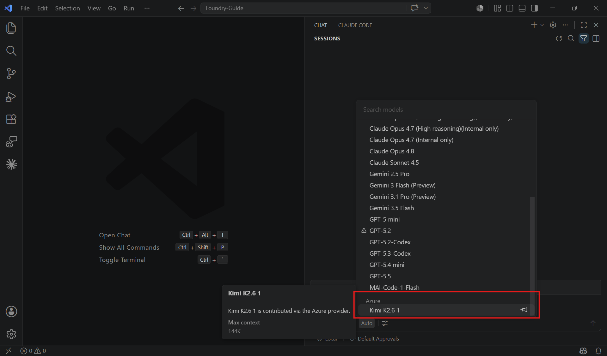
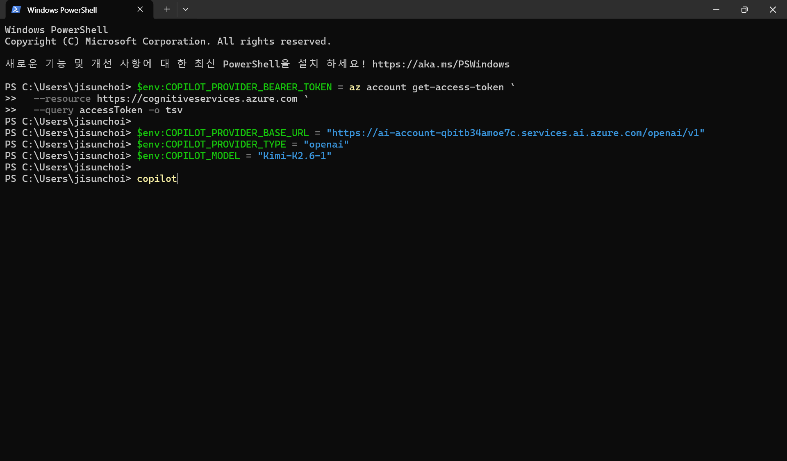
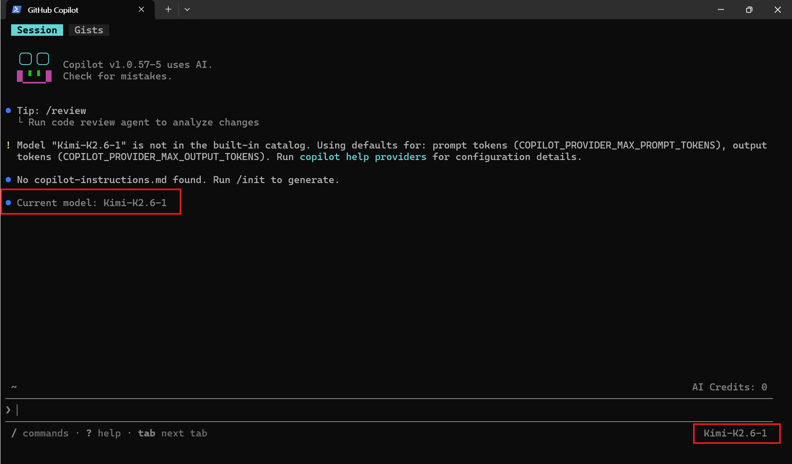
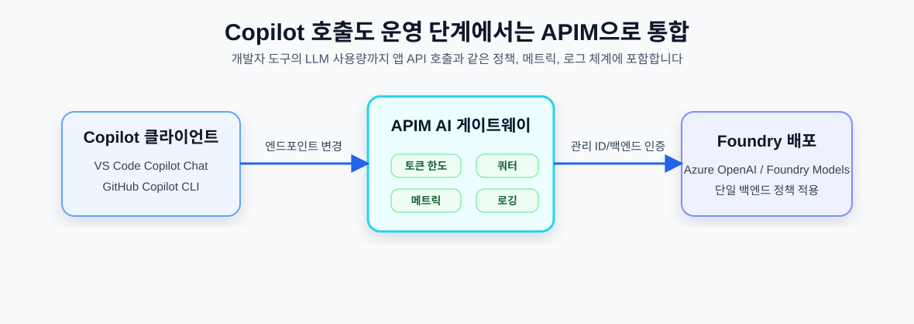

# 03. Copilot에서 Foundry 모델 호출하기 (BYOK)

VS Code Copilot Chat과 GitHub Copilot CLI에서 Foundry 또는 APIM 경유 모델을 호출하는 방법을 정리합니다.

## 이 문서에서 다루는 내용

- VS Code Copilot Chat BYOK 모델 추가
- GitHub Copilot CLI custom provider 설정
- API key와 Entra ID bearer token 사용 차이
- APIM 게이트웨이를 경유한 운영 전환 방식

## 0. 사전 준비 (공통)

- **엔드포인트 URL**: 직접 연결 시 `https://<리소스이름>.openai.azure.com` 또는 `https://<리소스이름>.services.ai.azure.com/openai/v1`을 사용합니다. 운영 전환 후에는 APIM 게이트웨이 URL을 사용합니다.
- **배포 이름**: 예: `my-gpt4o-prod`. Copilot 설정에서는 모델 ID처럼 사용합니다.
- **모델 요건**: **툴 호출(tool calling) + 스트리밍** 지원 필수. 컨텍스트 윈도우는 **128k 이상 권장**입니다.
- **인증 방식**: VS Code Copilot Chat은 Azure provider에서 Entra ID 구성이 가능하고, Copilot CLI의 custom provider는 API key 또는 bearer token 환경 변수를 사용합니다.

권장 인증 방식은 호출 주체별로 다릅니다.

- **앱/서비스 코드**: [02. API 호출](02-api-calls.md)의 운영 권장 방식처럼 **Entra ID / Managed Identity**를 사용합니다.
- **VS Code Copilot Chat**: **Entra ID 가능**, API key도 가능합니다. VS Code BYOK의 Azure provider 예시는 Entra ID 인증 구성을 보여줍니다.
- **GitHub Copilot CLI**: **API key 또는 Entra ID bearer token**을 사용합니다. 공식 BYOK 문서는 API key 예시를 중심으로 설명하지만, CLI 도움말과 실제 테스트 기준 `COPILOT_PROVIDER_BEARER_TOKEN`도 지원합니다.

> 에이전트 모드(파일 편집/툴 실행)로 쓰려면 모델이 반드시 **tool calling**을 지원해야 합니다 (예: gpt-4o, gpt-4.1).

## Part A. VS Code Copilot Chat

### A-1. 추가 순서

1. Copilot **Chat** 창을 엽니다.
2. **모델 선택기** → **톱니 / Manage Models** 아이콘 (또는 명령 팔레트 `Ctrl+Shift+P` → **"Chat: Manage Language Models"**)


3. **Add Models** → 공급자로 **Azure** 선택


4. **그룹 이름** 입력 → **엔드포인트 URL** 과 인증 정보 입력
5. VS Code가 `chatLanguageModels.json`을 열어 모델 속성 설정(`id`, `name`, `url`, 툴 호출/비전/토큰 한도 등)
6. 저장 → Azure 모델이 **모델 선택기에 표시**됩니다.


### A-2. `chatLanguageModels.json` 예시

아래 예시는 VS Code 공식 문서의 Azure provider 형식입니다. `apiKey` 필드를 두지 않고 Azure provider가 Entra ID 인증으로 Azure OpenAI/Foundry 배포를 호출하는 구성을 기준으로 합니다.

```jsonc
[
  {
    "name": "Azure",
    "vendor": "azure",
    "models": [
      {
        "id": "my-gpt4o-prod",
        "name": "Foundry GPT-4o (사내)",
        "url": "https://<리소스이름>.openai.azure.com",
        "toolCalling": true,
        "vision": true,
        "maxInputTokens": 128000,
        "maxOutputTokens": 16384
      }
    ]
  }
]
```

> BYOK 기능 범위·가용성은 Copilot 요금제에 따라 다를 수 있습니다(VS Code 문서 기준).

## Part B. GitHub Copilot CLI

GitHub Copilot CLI는 GitHub 호스팅 모델 대신 **자체 모델 공급자**를 쓰도록 설정할 수 있습니다. 지원: **Azure OpenAI**, OpenAI 호환 엔드포인트(Ollama·vLLM 포함), Anthropic.

공식 BYOK 문서는 주로 `COPILOT_PROVIDER_API_KEY` 예시를 안내하지만, 현재 CLI의 `copilot help providers` 기준으로는 `COPILOT_PROVIDER_BEARER_TOKEN`도 지원합니다. 즉, VS Code Azure provider처럼 로그인 상태를 자동 재사용하는 방식은 아니지만, Azure CLI로 발급받은 Entra ID access token을 bearer token으로 넣어 Foundry 엔드포인트를 호출할 수 있습니다.

실제 검증 결과, `Kimi-K2.6-1` 배포는 API key 없이 원격 Foundry 엔드포인트를 호출하면 401이 발생했고, `az account get-access-token`으로 받은 토큰을 `COPILOT_PROVIDER_BEARER_TOKEN`에 넣으면 정상 응답했습니다.

### B-1. 환경 변수로 설정

- `COPILOT_PROVIDER_TYPE`: Azure OpenAI native endpoint는 `azure`, Foundry `/openai/v1` 호환 엔드포인트는 `openai`를 사용합니다.
- `COPILOT_PROVIDER_BASE_URL`: 예: `https://<리소스이름>.services.ai.azure.com/openai/v1` 또는 `https://<리소스이름>.openai.azure.com/openai/v1`
- `COPILOT_PROVIDER_API_KEY`: API key 방식일 때 사용합니다.
- `COPILOT_PROVIDER_BEARER_TOKEN`: Entra ID bearer token 방식일 때 사용합니다. API key보다 우선 적용됩니다.
- `COPILOT_MODEL`: 배포 이름을 넣습니다. 예: `my-gpt4o-prod`, `Kimi-K2.6-1`

**bash / zsh (macOS·Linux) - Entra ID bearer token 방식**:

```bash
export COPILOT_PROVIDER_BEARER_TOKEN=$(az account get-access-token \
  --resource https://cognitiveservices.azure.com \
  --query accessToken -o tsv)

export COPILOT_PROVIDER_BASE_URL="https://ai-account-qbitb34amoe7c.services.ai.azure.com/openai/v1"
export COPILOT_PROVIDER_TYPE="openai"
export COPILOT_MODEL="Kimi-K2.6-1"

copilot
```

**bash / zsh (macOS·Linux) - API key 방식**:

```bash
export COPILOT_PROVIDER_TYPE="openai"
export COPILOT_PROVIDER_BASE_URL="https://<리소스이름>.services.ai.azure.com/openai/v1"
export COPILOT_PROVIDER_API_KEY="<API_KEY>"
export COPILOT_MODEL="<배포이름>"

copilot
```




> `copilot help providers` 로 현재 설정과 지원 공급자를 확인할 수 있습니다. 이 도움말에는 `COPILOT_PROVIDER_BEARER_TOKEN`이 API key보다 우선 적용된다고 설명되어 있습니다.

> bearer token은 만료 시간이 짧습니다. 새 터미널을 열었거나 토큰이 만료되면 `az account get-access-token`으로 다시 발급받아야 합니다.

> `COPILOT_PROVIDER_API_KEY`와 `COPILOT_PROVIDER_BEARER_TOKEN`을 동시에 설정하지 마세요. 테스트할 때는 쓰지 않는 값을 `unset COPILOT_PROVIDER_API_KEY`처럼 제거하면 혼동을 줄일 수 있습니다.

### B-2. 모델 목록에 보이지 않는 이유

BYOK 모델은 GitHub 호스팅 모델 카탈로그에 등록되는 것이 아니라, 환경 변수로 지정한 provider와 model을 현재 CLI 세션에 적용하는 방식입니다. 따라서 `Kimi-K2.6-1` 같은 Foundry 배포 이름은 `/model` 목록에 표시되지 않을 수 있습니다.

대신 다음 중 하나로 모델을 지정합니다.

- `COPILOT_MODEL=<배포이름>`
- `COPILOT_PROVIDER_MODEL_ID=<잘 알려진 기준 모델 ID>` + `COPILOT_PROVIDER_WIRE_MODEL=<실제 provider에 보낼 배포 이름>`
- 실행 시 `--model <배포이름>`

`COPILOT_MODEL`은 내부 모델 ID와 provider에 전달할 wire model 이름을 모두 같은 값으로 설정하는 가장 단순한 방식입니다.

### B-3. 모델 전환

- GitHub 호스팅 모델은 세션 중 `/model` 슬래시 명령으로 바꿉니다.
- BYOK 모델은 환경 변수(`COPILOT_MODEL`, `COPILOT_PROVIDER_WIRE_MODEL`)로 지정하는 것이 가장 명확합니다.
- 실행 시 `--model <배포이름>` 옵션으로도 지정할 수 있습니다.

### B-4. 요건

- 커스텀 모델은 **tool calling(함수 호출) + 스트리밍**을 지원해야 합니다.
- 컨텍스트 윈도우 **128k 이상 권장**.

## Part C. 운영 전환 — APIM 게이트웨이를 거쳐 연결

VS Code Copilot이든 Copilot CLI든, 운영 환경에서는 엔드포인트를 **Foundry 직결 대신 [04. 전체 API 호출 거버닝 아키텍처](04-api-governance-architecture.md)의 APIM 엔드포인트**로 지정하세요.



→ **앱의 API 호출과 개발자의 Copilot 사용량까지** 같은 토큰 한도·메트릭·로깅에 포함되어 전사 거버넌스가 일관됩니다.

- VS Code: `chatLanguageModels.json`의 `url`을 APIM 게이트웨이 URL로 변경하고, APIM 구독 키가 필요하면 모델 항목에 `requestHeaders` 추가
- Copilot CLI: `azure` provider로 APIM 게이트웨이 루트 URL을 지정하고, APIM의 Azure OpenAI 호환 API가 `api-key` 헤더를 subscription key로 받도록 구성

### C-1. VS Code Copilot Chat에서 APIM API 추가

VS Code에서 APIM subscription key를 요구하는 API를 붙일 때는 기존 Azure provider 아래에 APIM 모델을 추가하고, 모델 객체 안에 `requestHeaders`를 넣으면 됩니다.

**Foundry 직접 연결 + APIM 경유 모델을 함께 등록하는 예시**:

```jsonc
[
  {
    "name": "Azure",
    "vendor": "azure",
    "models": [
      {
        "id": "Kimi-K2.6-1",
        "name": "Kimi K2.6 1",
        "url": "https://ai-account-qbitb34amoe7c.services.ai.azure.com/openai/v1",
        "toolCalling": true,
        "vision": false,
        "maxInputTokens": 128000,
        "maxOutputTokens": 16000
      },
      {
        "id": "gpt-4o",
        "name": "GPT-4o via APIM",
        "url": "https://apim-ai-gw-eastus-demo.azure-api.net/models/chat/completions",
        "toolCalling": false,
        "vision": true,
        "maxInputTokens": 128000,
        "maxOutputTokens": 16000,
        "requestHeaders": {
          "Ocp-Apim-Subscription-Key": "<APIM_SUBSCRIPTION_KEY>"
        }
      }
    ]
  }
]
```

> 검증 결과: `requestHeaders` 없이 호출하면 APIM에서 `missing subscription key` 오류가 발생합니다. `Ocp-Apim-Subscription-Key`를 추가하면 APIM 인증은 통과합니다. 이후 `content_filter` 오류가 발생하는 경우는 APIM 연결 문제가 아니라 백엔드 Azure OpenAI/Foundry 콘텐츠 필터가 프롬프트를 차단한 것입니다.

### C-2. Copilot CLI에서 APIM API 호출

Copilot CLI는 APIM의 `/models/chat/completions` 경로를 `openai` provider로 호출하는 방식보다, APIM의 Azure OpenAI 호환 API(`/openai/deployments/{deployment-id}/chat/completions`)를 `azure` provider로 호출하는 방식이 맞습니다.

APIM API의 subscription key header 이름이 `api-key`인지 먼저 확인합니다.

```bash
az apim api show \
  --resource-group rg-ai-foundry \
  --service-name apim-ai-gw-eastus-demo \
  --api-id azure-openai-api \
  --query "subscriptionKeyParameterNames" \
  -o json
```

결과의 `header` 값이 `api-key`가 아니면 다음처럼 변경합니다.

```bash
az apim api update \
  --resource-group rg-ai-foundry \
  --service-name apim-ai-gw-eastus-demo \
  --api-id azure-openai-api \
  --subscription-key-header-name api-key \
  --subscription-key-query-param-name subscription-key
```

Copilot CLI를 APIM 경유로 실행하는 예시입니다.

```bash
export COPILOT_PROVIDER_TYPE="azure"
export COPILOT_PROVIDER_BASE_URL="https://apim-ai-gw-eastus-demo.azure-api.net"
export COPILOT_PROVIDER_API_KEY="<APIM_SUBSCRIPTION_KEY>"
export COPILOT_PROVIDER_AZURE_API_VERSION="2024-10-21"
export COPILOT_MODEL="gpt-4o"

copilot -p "Reply with exactly: APIM_CLI_OK"
```

이 구성에서 Copilot CLI는 다음 APIM 경로를 호출합니다.

```text
https://apim-ai-gw-eastus-demo.azure-api.net/openai/deployments/gpt-4o/chat/completions?api-version=2024-10-21
```

> 검증 결과: 위 구성으로 `APIM_CLI_OK` 응답을 확인했습니다. `openai` provider + `/models` API 조합은 모델 검증/호출 경로가 APIM 라우트와 맞지 않아 실패할 수 있습니다.

## 다음 단계

직접 API 호출과 Copilot 호출이 모두 검증되면, 이 호출들을 한 진입점으로 모아 통제하는 **[04. 전체 API 호출 거버닝 아키텍처](04-api-governance-architecture.md)** 로 진행하세요.

## 참고 문서

- [VS Code – Language models / BYOK](https://code.visualstudio.com/docs/copilot/customization/language-models)
- [GitHub Copilot in VS Code](https://code.visualstudio.com/docs/copilot/overview)
- [GitHub Copilot CLI에서 사용자 고유의 LLM 모델 사용](https://docs.github.com/ko/copilot/how-tos/copilot-cli/customize-copilot/use-byok-models)
- [About GitHub Copilot CLI](https://docs.github.com/en/copilot/concepts/agents/copilot-cli/about-copilot-cli)
- [Azure OpenAI in Microsoft Foundry Models v1 API](https://learn.microsoft.com/en-us/azure/ai-foundry/model-inference/how-to/use-chat-completions)
- [Azure OpenAI Entra ID / managed identity 인증](https://learn.microsoft.com/en-us/azure/ai-foundry/openai/how-to/managed-identity)
- [APIM으로 LLM API 인증·권한 부여](https://learn.microsoft.com/en-us/azure/api-management/api-management-authenticate-authorize-ai-apis)
