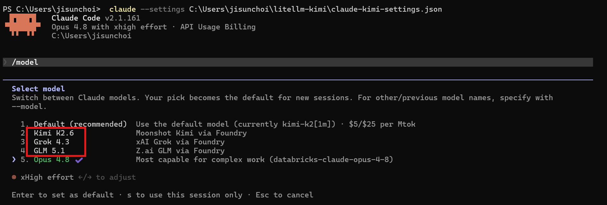
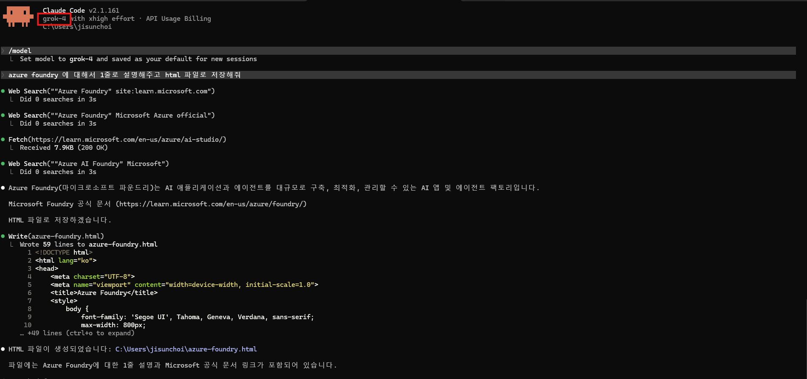
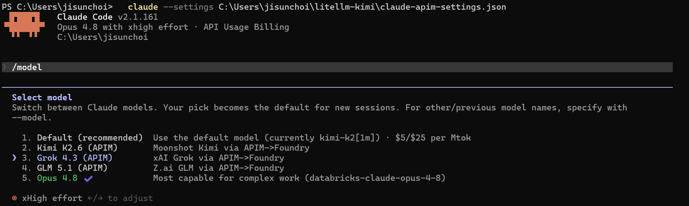
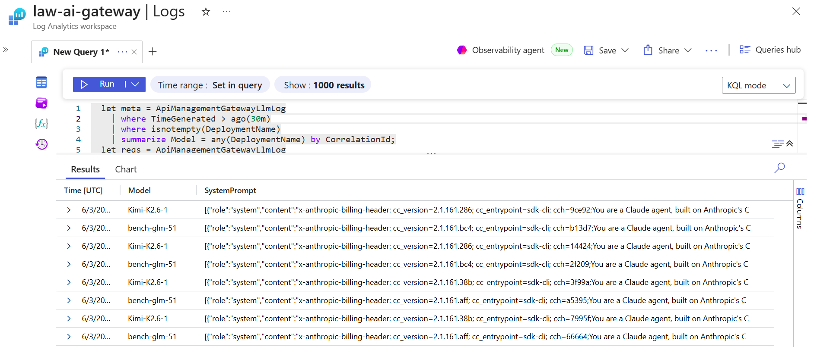

# 03b. Claude Code에서 Foundry 모델 호출하기 (LiteLLM 경유)

Claude Code(Anthropic 공식 CLI)에서 Foundry에 배포된 모델(Kimi, Grok, GLM 등)을 호출하는 방법을 정리합니다.

> 이 문서는 **실험/참고용 문서입니다.** 이 구성은 서드파티 오픈소스 프록시(LiteLLM)에 의존하며, Anthropic·Microsoft가 보증하는 공식 통합 경로가 아닙니다. 동작은 검증했으나, 프로덕션 도입 전 아래 "공식/비공식 경계"를 확인하고 각 조직의 보안·지원 정책에 맞는지 판단하세요.
>
> **공식으로 지원되는 부분**
> - Claude Code의 게이트웨이 연결(`ANTHROPIC_BASE_URL`) 및 모델 설정 파라미터 — [Anthropic 공식 문서](https://code.claude.com/docs/en/llm-gateway)
> - Foundry의 Entra ID(키리스) 인증 — [Microsoft Learn](https://learn.microsoft.com/en-us/azure/foundry/foundry-models/how-to/configure-entra-id)
>
> **비공식(자기 책임) 영역**
> - **LiteLLM 프록시 의존**: Anthropic 문서는 LiteLLM을 예시로 안내하지만 "third-party 제품으로 보증·유지보수·감사하지 않는다"고 명시합니다. 보안 패치·버전 관리·운영 책임은 도입 조직에 있습니다.
> - **Anthropic↔OpenAI 포맷 변환**: tool calling·스트리밍 변환은 LiteLLM 구현에 의존하므로, 모델/버전에 따라 일부 기능에 마찰이 있을 수 있습니다.
> - **opus/sonnet/haiku 별칭에 비-Claude 모델 매핑**: 동작하는 구성이지만 Anthropic이 권장하는 패턴은 아닙니다.

## 이 문서에서 다루는 내용

- Claude Code의 모델 연결 방식과 포맷 제약
- LiteLLM 프록시를 경유해 Foundry 모델 연결
- API key 대신 Entra ID 자동 갱신 인증
- `/model`로 여러 Foundry 모델 전환
- APIM 게이트웨이를 경유한 운영 전환 방식

## 0. 사전 준비 (공통)

- **엔드포인트 URL**: Foundry 리소스 루트 `https://<리소스이름>.services.ai.azure.com`을 사용합니다. 운영 전환 후에는 APIM 게이트웨이 URL을 사용합니다.
- **배포 이름**: 예: `Kimi-K2.6-1`. LiteLLM `config.yaml`에서 모델 라우팅 대상으로 사용합니다.
- **모델 요건**: **툴 호출(tool calling) + 스트리밍** 지원 필수. 컨텍스트 윈도우는 **128k 이상 권장**입니다.
- **인증 방식**: Entra ID(키리스)를 권장합니다. LiteLLM이 `DefaultAzureCredential`로 토큰을 자동 발급·갱신하므로 API key가 필요 없습니다.

> 에이전트 모드(파일 편집/툴 실행)로 쓰려면 모델이 반드시 **tool calling**을 지원해야 합니다 (예: Kimi-K2, Grok).

## 1. 왜 프록시가 필요한가 — 포맷 차이

Claude Code는 모델 호출 시 **Anthropic Messages API**(`/v1/messages`) 형식을 사용합니다. `ANTHROPIC_BASE_URL`이 가리키는 엔드포인트는 반드시 이 형식을 노출해야 합니다.

반면 Foundry에 배포된 Kimi·Grok·GLM 등은 **OpenAI 호환 형식**(`/openai/v1/chat/completions`)만 노출합니다. 따라서 base URL만 Foundry로 바꿔서는 동작하지 않고, 중간에서 **Anthropic ↔ OpenAI 포맷을 변환**하는 게이트웨이가 필요합니다.

```text
Claude Code  ──(/v1/messages, Anthropic)──▶  LiteLLM  ──(OpenAI 호환 + Entra ID 토큰)──▶  Foundry (Kimi / Grok / GLM)
```

[LiteLLM](https://docs.litellm.ai/)은 이 변환을 기본 제공하는 오픈소스 프록시입니다. tool calling·스트리밍·thinking 블록 매핑까지 처리합니다.


## 2. LiteLLM 프록시 설정 

### 2-1. 설치

```bash
pip install "litellm[proxy]"
```

> LiteLLM 1.82.7 / 1.82.8 버전은 보안 문제가 있으니 그 외 버전을 사용하세요.

### 2-2. `config.yaml` 샘플

Foundry 배포 여러 개를 한 프록시에 등록할 수 있습니다. 인증은 `enable_azure_ad_token_refresh`로 Entra ID 자동 갱신을 사용합니다 (API key 불필요).

```yaml
model_list:
  - model_name: kimi-k2
    litellm_params:
      model: azure_ai/Kimi-K2.6-1
      # 루트 엔드포인트만 (끝에 /openai/v1 붙이지 않음). azure_ai가 경로를 구성합니다.
      api_base: os.environ/AZURE_AI_API_BASE_ROOT
  - model_name: grok-4
    litellm_params:
      model: azure_ai/<grok 배포이름>
      api_base: os.environ/AZURE_AI_API_BASE_ROOT
  - model_name: glm-5
    litellm_params:
      model: azure_ai/<glm 배포이름>
      api_base: os.environ/AZURE_AI_API_BASE_ROOT

litellm_settings:
  drop_params: true
  # DefaultAzureCredential 기반 토큰 자동 갱신 (scope: cognitiveservices.azure.com/.default)
  # az login 세션을 사용하며, 토큰 만료 시 프록시 재기동 없이 자동 갱신됩니다.
  enable_azure_ad_token_refresh: true

general_settings:
  master_key: os.environ/LITELLM_MASTER_KEY
```

### 2-3. 실행

```bash
export PYTHONUTF8=1                                                    # Windows 콘솔 인코딩
export AZURE_AI_API_BASE_ROOT="https://<리소스이름>.services.ai.azure.com"
export LITELLM_MASTER_KEY="sk-local-anything"                         # Claude Code가 보낼 임의 키

litellm --config config.yaml --port 4000 --host 127.0.0.1
```


## 3. Claude Code 연결

Claude Code는 환경 변수 또는 settings 파일로 엔드포인트를 지정합니다. 기존 설정과 섞이지 않도록 **별도 settings 파일**을 만들어 `--settings`로 띄우는 방식을 권장합니다.

### 3-1. `claude-foundry-settings.json` 예시

`/model` 선택기에 모델을 깔끔하게 표시하기 위해, Claude Code의 `opus`/`sonnet`/`haiku` 별칭 슬롯을 Foundry 모델에 1:1 매핑합니다.

```jsonc
{
  "env": {
    "ANTHROPIC_BASE_URL": "http://127.0.0.1:4000",
    "ANTHROPIC_AUTH_TOKEN": "sk-local-anything",
    "ANTHROPIC_CUSTOM_HEADERS": "",
    "CLAUDE_CODE_DISABLE_EXPERIMENTAL_BETAS": "1",

    "ANTHROPIC_DEFAULT_OPUS_MODEL": "kimi-k2",
    "ANTHROPIC_DEFAULT_OPUS_MODEL_NAME": "Kimi K2.6",
    "ANTHROPIC_DEFAULT_OPUS_MODEL_DESCRIPTION": "Moonshot Kimi via Foundry",

    "ANTHROPIC_DEFAULT_SONNET_MODEL": "grok-4",
    "ANTHROPIC_DEFAULT_SONNET_MODEL_NAME": "Grok 4.3",
    "ANTHROPIC_DEFAULT_SONNET_MODEL_DESCRIPTION": "xAI Grok via Foundry",

    "ANTHROPIC_DEFAULT_HAIKU_MODEL": "glm-5",
    "ANTHROPIC_DEFAULT_HAIKU_MODEL_NAME": "GLM 5.1",
    "ANTHROPIC_DEFAULT_HAIKU_MODEL_DESCRIPTION": "Z.ai GLM via Foundry"
  },
  "model": "opus",
  "availableModels": ["opus", "sonnet", "haiku"]
}
```

### 3-2. 실행

```bash
claude --settings claude-foundry-settings.json
```


## 4. 모델 전환

- 세션 중 `/model` 슬래시 명령으로 선택기를 열어 전환합니다. 위 설정이면 선택기에 다음처럼 표시됩니다.

  ```text
  Select model
   1. Default (recommended)
   2. Kimi K2.6      Moonshot Kimi via Foundry
   3. Grok 4.3       xAI Grok via Foundry
   4. GLM 5.1        Z.ai GLM via Foundry
  ```

  


- 별칭으로 직접 지정할 수도 있습니다: `/model opus`(Kimi), `/model sonnet`(Grok), `/model haiku`(GLM).
- 실행 시 `claude --settings ... --model sonnet` 처럼 지정할 수도 있습니다.





## 5. 요건

- 커스텀 모델은 **tool calling(함수 호출) + 스트리밍**을 지원해야 합니다.
- 컨텍스트 윈도우 **128k 이상 권장**.
- effort 레벨·extended thinking 등 일부 Claude 전용 기능은 비-Claude 모델에서 인식되지 않을 수 있습니다. 기본 대화·코딩·도구 호출은 정상 동작합니다.

## Part C. 운영 전환 — APIM 게이트웨이를 거쳐 연결

운영 환경에서는 LiteLLM의 백엔드(`api_base`)를 **Foundry 직결 대신 [04. 전체 API 호출 거버닝 아키텍처](04-api-governance-architecture.md)의 APIM 엔드포인트**로 지정하세요.

→ **앱의 API 호출과 개발자의 Claude Code 사용량까지** 같은 토큰 한도·메트릭·로깅에 포함되어 전사 거버넌스가 일관됩니다.

- LiteLLM `config.yaml`의 `api_base`를 APIM 게이트웨이 URL로 변경하고, APIM 구독 키가 필요하면 `litellm_params`에 헤더(`extra_headers`)로 `Ocp-Apim-Subscription-Key`를 추가합니다.
- APIM 자체가 변환기는 아닙니다(OpenAI 호환/패스스루 라우팅). Claude Code의 Anthropic↔OpenAI 변환은 계속 LiteLLM이 담당하고, APIM은 그 앞단에서 인증·토큰 제한·로깅을 맡는 2계층 구성이 가장 견고합니다.




## 프로덕션 도입 전 체크리스트

이 문서는 실험·검증 목적입니다. 실제 도입을 검토한다면 최소한 다음을 확인하세요.

- **프록시 운영 주체**: LiteLLM의 배포·버전 관리·보안 패치를 누가 책임지는지 명확히 합니다. 컨테이너로 격리하고 신뢰할 수 있는 버전을 핀(pin)하세요.
- **인증 경로**: 로컬 `az login` 기반은 개발용입니다. 운영에서는 Managed Identity 또는 서비스 주체로 전환합니다.
- **거버넌스 통합**: 토큰 한도·로깅·메트릭이 필요하면 APIM을 앞단에 두는 2계층으로 구성합니다([04. 거버닝 아키텍처](04-api-governance-architecture.md)).
- **대안 검토**: 조직 정책상 서드파티 프록시가 부담스럽다면, 공식 경로가 확실한 [Copilot 연동(03)](03-copilot-foundry-integration.md)을 우선 고려합니다.

## 다음 단계

직접 API 호출과 Copilot·Claude Code 호출이 모두 검증되면, 이 호출들을 한 진입점으로 모아 통제하는 **[04. 전체 API 호출 거버닝 아키텍처](04-api-governance-architecture.md)** 로 진행하세요.

## 참고 문서

- [Claude Code – LLM gateway configuration](https://code.claude.com/docs/en/llm-gateway)
- [Claude Code – Model configuration](https://code.claude.com/docs/en/model-config)
- [LiteLLM – Azure AI Studio provider](https://docs.litellm.ai/docs/providers/azure_ai)
- [LiteLLM – Azure AD token refresh](https://docs.litellm.ai/docs/providers/azure/)
- [Azure OpenAI in Microsoft Foundry Models v1 API](https://learn.microsoft.com/en-us/azure/ai-foundry/model-inference/how-to/use-chat-completions)
- [키리스 인증 (Microsoft Entra ID) 구성](https://learn.microsoft.com/en-us/azure/foundry/foundry-models/how-to/configure-entra-id)
- [APIM으로 LLM API 인증·권한 부여](https://learn.microsoft.com/en-us/azure/api-management/api-management-authenticate-authorize-ai-apis)
