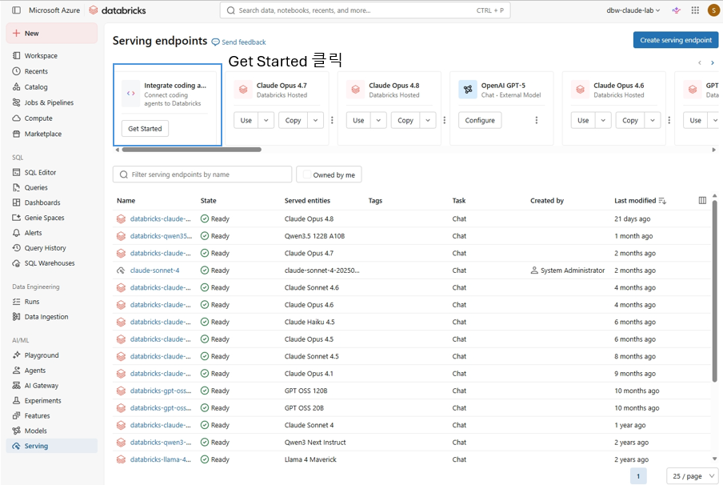
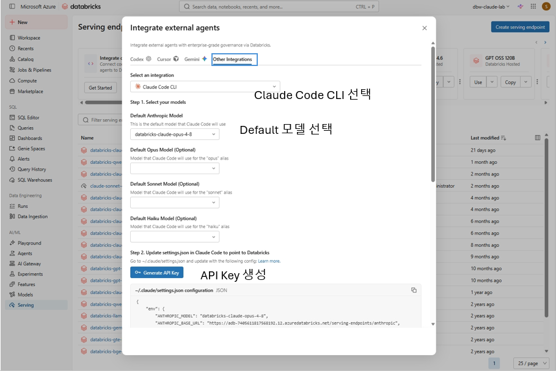
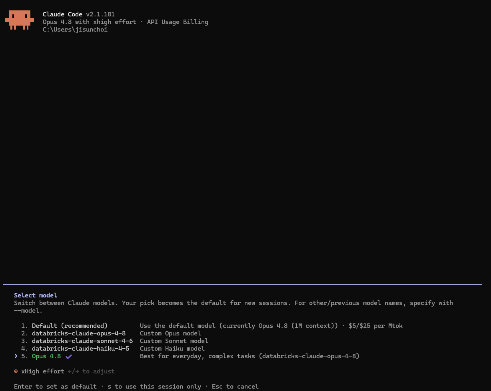

# 03b1. Calling Databricks-Hosted Claude from Claude Code

This document covers how to call a Claude model served on Azure Databricks (e.g., `databricks-claude-opus-4-8`) from Claude Code (Anthropic's official CLI).

> Unlike [03b. Claude Code + Foundry (LiteLLM)](03b-claude-code-foundry-integration.md), this setup needs **no conversion proxy (LiteLLM)**. Azure Databricks directly exposes an **Anthropic-compatible serving endpoint** (`/serving-endpoints/anthropic`), so you only need to point Claude Code's `ANTHROPIC_BASE_URL` at it and it connects as-is.

## What this document covers

- Getting the Claude Code configuration from the Databricks portal's "Integrate external agents"
- Connecting `ANTHROPIC_BASE_URL` directly to the Databricks serving endpoint
- Applying the coding-agent-mode header (`x-databricks-use-coding-agent-mode`)
- Authenticating with a personal access token (PAT)
- Switching between Databricks Claude models mapped to the opus/sonnet/haiku slots with `/model`

## 0. Prerequisites

- **Workspace URL**: Use your Azure Databricks per-workspace URL. e.g., `https://adb-7405611817568192.12.azuredatabricks.net`
- **Serving endpoint name**: The name of the Claude model endpoint deployed in Databricks. e.g., `databricks-claude-opus-4-8`. Find it in the Endpoints list under the **Serving** tab on the left of the workspace.

> To use it in agent mode (file editing/tool execution), the model must support **tool calling**. The Claude models hosted by Databricks support it.

## 1. Get the configuration from the portal

The Databricks workspace generates the Claude Code connection configuration for you.

1. Go to the **Serving** tab on the left.
2. In the **Integrate external agents** card at the top, click **Get Started**.


3. On the **Other Integrations** tab, set **Select an integration** to **Claude Code CLI**.
4. Under **Select your models**, specify the models Claude Code will use.
   - **Default Anthropic Model**: the default model. e.g., `databricks-claude-opus-4-8`
   - **Default Opus / Sonnet / Haiku Model (Optional)**: the models to map to the `opus`/`sonnet`/`haiku` aliases respectively (optional). Leave them empty to use only the default model.
5. Under **Update settings.json**, click **Generate API Key** to issue a token, then copy the displayed `settings.json` configuration.



The configuration the portal generates looks like this:

```jsonc
{
  "env": {
    "ANTHROPIC_MODEL": "databricks-claude-opus-4-8",
    "ANTHROPIC_BASE_URL": "https://adb-7405611817568192.12.azuredatabricks.net/serving-endpoints/anthropic",
    "ANTHROPIC_AUTH_TOKEN": "<your_token_will_appear_here>",
    "ANTHROPIC_CUSTOM_HEADERS": "x-databricks-use-coding-agent-mode: true",
    "CLAUDE_CODE_DISABLE_EXPERIMENTAL_BETAS": "1"
  }
}
```

| Key | Meaning |
| --- | --- |
| `ANTHROPIC_MODEL` | The Databricks serving endpoint name to call by default |
| `ANTHROPIC_BASE_URL` | The Anthropic-compatible endpoint, formed by appending `/serving-endpoints/anthropic` to the workspace URL |
| `ANTHROPIC_AUTH_TOKEN` | The authentication token (see [3. Authentication](#3-authentication) below) |
| `ANTHROPIC_CUSTOM_HEADERS` | The coding-agent-mode header. Turns on Claude Code-specific behavior |
| `CLAUDE_CODE_DISABLE_EXPERIMENTAL_BETAS` | Disables Claude-only experimental betas (for compatibility) |

## 2. Connect Claude Code

To avoid mixing with your existing settings, we recommend creating a **separate settings file** and launching with `--settings`.

### 2-1. Example `claude-databricks-settings.json`

To display models cleanly in the `/model` selector, you can map the `opus`/`sonnet`/`haiku` alias slots to Databricks endpoints (optional).

```jsonc
{
  "env": {
    "ANTHROPIC_BASE_URL": "https://adb-7405611817568192.12.azuredatabricks.net/serving-endpoints/anthropic",
    "ANTHROPIC_AUTH_TOKEN": "<the token you issued>",
    "ANTHROPIC_CUSTOM_HEADERS": "x-databricks-use-coding-agent-mode: true",
    "CLAUDE_CODE_DISABLE_EXPERIMENTAL_BETAS": "1",

    "ANTHROPIC_MODEL": "databricks-claude-opus-4-8",

    "ANTHROPIC_DEFAULT_OPUS_MODEL": "databricks-claude-opus-4-8",
    "ANTHROPIC_DEFAULT_SONNET_MODEL": "databricks-claude-sonnet-4-6",
    "ANTHROPIC_DEFAULT_HAIKU_MODEL": "databricks-claude-haiku-4-5"
  },
  "model": "opus"
}
```

> For the `ANTHROPIC_DEFAULT_*` values, use serving endpoint names that actually exist in your workspace. If you don't need the mapping, you can keep just `ANTHROPIC_MODEL`.

### 2-2. Run

```bash
claude --settings claude-databricks-settings.json
```

## 3. Authentication

This document uses the **personal access token (PAT)** method that the portal guides you through. A PAT is **key-based (workspace token) authentication**.

- The portal's **Generate API Key** issues a PAT; put the issued value in `ANTHROPIC_AUTH_TOKEN`.
- To issue one yourself, use **Settings → Developer → Access tokens → Manage → Generate new token** in the workspace.
- Tokens have a **lifetime**. When one expires, issue a new one and replace the value in the settings file. Tokens unused for 90 days are revoked automatically.
- The token is a secret. Don't commit it to source or git; store it securely.

> For user-account authentication, Databricks recommends **Databricks OAuth** over PATs. If key-based tokens are restricted by your organization's policy, work with your administrator on Databricks OAuth or a service-principal-based token issuance method.

## 4. Switching models

- During a session, open the selector with the `/model` slash command to switch. With the configuration above, the `opus` (Opus) / `sonnet` (Sonnet) / `haiku` (Haiku) slots connect to their respective Databricks endpoints.
- You can also specify an alias directly: `/model opus`, `/model sonnet`, `/model haiku`.
- You can also specify it at launch, like `claude --settings ... --model sonnet`.



## 5. Requirements and notes

- The target **serving endpoint must be in the Ready state**. An endpoint asleep due to scale-to-zero may have cold-start latency on the first call.
- The `x-databricks-use-coding-agent-mode: true` header activates Claude Code-specific behavior. If it's missing from `ANTHROPIC_CUSTOM_HEADERS`, it may not work correctly.
- When a token expires, you get a 401. Re-issue and replace the token.
- Model/endpoint availability and limits vary by workspace region and configuration. See the reference docs below for details.

## Reference docs

- [Claude Code – Model configuration](https://code.claude.com/docs/en/model-config)
- [Claude Code – LLM gateway configuration](https://code.claude.com/docs/en/llm-gateway)
- [Databricks Foundation Model APIs (Azure)](https://learn.microsoft.com/en-us/azure/databricks/machine-learning/foundation-model-apis/)
- [Query foundation models on Azure Databricks](https://learn.microsoft.com/en-us/azure/databricks/machine-learning/model-serving/score-foundation-models)
- [Azure Databricks personal access token (PAT) authentication](https://learn.microsoft.com/en-us/azure/databricks/dev-tools/auth/pat)
