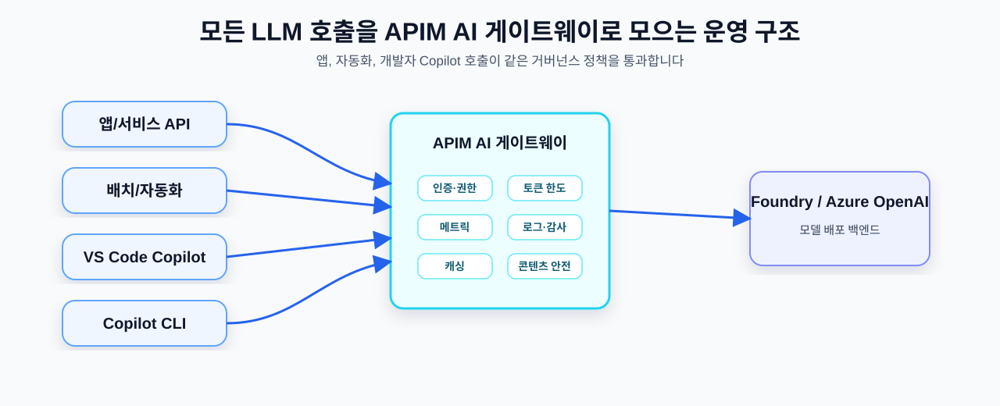
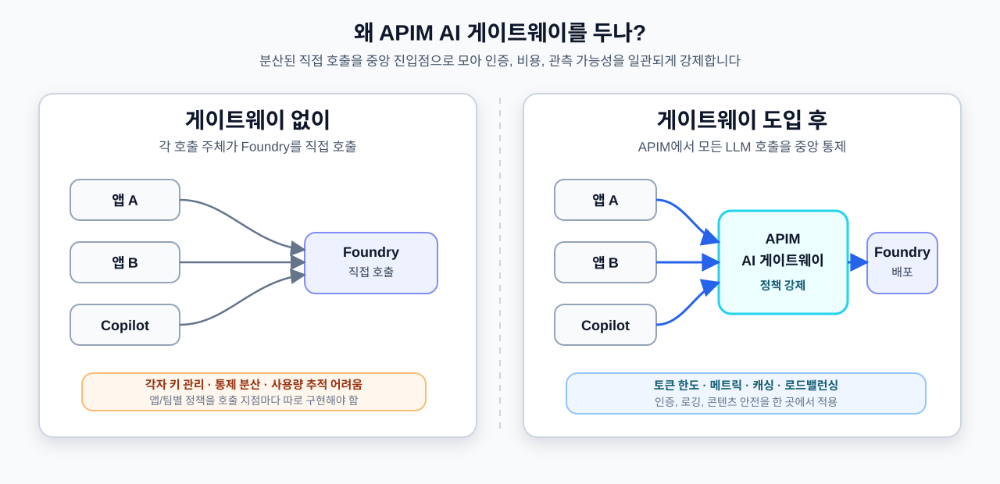
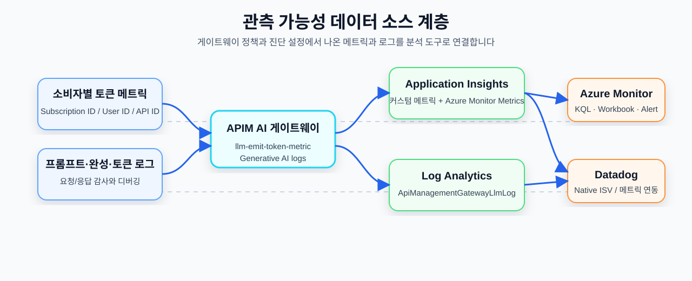

# 04. End-to-End API Call Governance Architecture — AI Gateway · Observability

> Up to the previous chapters, we ① called Foundry deployments directly from app code, and ② called the same deployments from VS Code Copilot / the Copilot CLI. In production, we consolidate all of these calls into the **APIM AI gateway** for control, track "who is using how much" with the gateway's **observability** (token metrics and logging), and tie it all together into an **enterprise reference architecture**.

## What this document covers

- The role of the APIM AI gateway
- Token limits, quotas, semantic caching, load balancing
- Observability based on Application Insights and Azure Monitor
- Connecting to an enterprise reference architecture



## Part A. APIM AI gateway — control all calls from one place

### A-1. What is the APIM "AI gateway"?

The "AI gateway" in **Azure API Management (APIM)** is **not a separate product** but a **set of features** included in the existing API gateway. (Feature availability varies by APIM tier.)

Supported:

- LLM APIs that follow the **OpenAI Chat Completions / Responses API** schema
- LLM APIs that follow the **Anthropic Messages API** schema (currently supported on the APIM v2 tier)
- Microsoft Foundry deployed models, non-Microsoft provider models such as Amazon Bedrock, and self-hosted models/endpoints
- Remote **MCP servers** and **A2A agent APIs**

### Why put a gateway in place?



- Enforce **token limits and quotas** per team/app (prevents cost blowups)
- Collect **per-consumer token metrics** (precise governance)
- Reduce response latency and backend call costs with **semantic caching** (requires the Embeddings API and a RediSearch-compatible external cache)
- **Load balance** across multiple model endpoints (e.g., prefer PTU first)
- **Authentication, logging, and content safety** at a single entry point


*Source: [AI gateway capabilities in Azure API Management](https://learn.microsoft.com/en-us/azure/api-management/genai-gateway-capabilities)*

## Part B. APIM gateway observability — per-consumer tokens and logging

Through policies and diagnostic settings, the APIM AI gateway **emits token consumption as metrics** for LLM calls passing through the gateway, and if needed **collects prompt/completion messages as logs**. The default flow is to analyze token metrics as Application Insights custom metrics and LLM logs in the `ApiManagementGatewayLlmLog` table of Azure Monitor Logs/Log Analytics.

### B-1. Token metrics — `llm-emit-token-metric`

Sends token consumption as **Application Insights custom metrics** → **precise per-consumer tracking**. Token categories may include total, prompt, completion, cached, reasoning, thinking, etc., depending on the model/provider response. You can configure up to **5 custom dimensions** per policy (the Azure Monitor custom metric limit).

Prerequisites:

- The LLM API must be added to APIM
- APIM must be integrated with Application Insights
- Application Insights logging and custom metrics with dimensions must be enabled for that LLM API

```xml
<llm-emit-token-metric namespace="genai">
  <dimension name="Subscription ID" value="@(context.Subscription.Id)" />
  <dimension name="Client IP"       value="@(context.Request.IpAddress)" />
  <dimension name="API ID"          value="@(context.Api.Id)" />
</llm-emit-token-metric>
```

→ With this metric you can track **per-team token consumption** in Azure Monitor dashboards/Workbooks. If you also use Datadog, you can integrate it into the same operational view via the Azure Native ISV integration or by configuring Azure Monitor metric collection.


### B-2. Logging · content safety · managed identity

- **Prompt/completion logging**: In APIM diagnostic settings, send "generative AI gateway" logs to Log Analytics, and turn on prompt/completion logging in the API's **Log LLM messages** setting. Messages may be split into 32KB chunks, and request/response messages are logged up to 2MB each.
- **Content safety**: Apply Azure AI Content Safety moderation with the `llm-content-safety` policy. The APIM managed identity needs Cognitive Services User permission on the Content Safety resource.
- **Managed identity authentication**: APIM authenticates to Azure AI services with a managed identity (keyless). The target resource ID for Azure AI services is typically `https://cognitiveservices.azure.com/`.

### B-3. Data source layers



- The **primary source for per-consumer token governance** is the Application Insights custom metrics emitted by `llm-emit-token-metric`.
- **Prompt/completion audit, debugging, and evaluation data** is analyzed with KQL in the `ApiManagementGatewayLlmLog` table of Azure Monitor Logs.
- To **track tokens precisely per consumer (team/app/user)**, it's important to choose dimensions whose cardinality you can control, such as `Subscription ID`, `User ID`, and `API ID`. Dimensions with too many unique values can quickly hit the Azure Monitor custom metric time-series limit.

## Part C. Enterprise reference architecture — AI Hub Gateway Landing Zone

This is the comprehensive architecture of the official Azure-Samples solution accelerator **AI Hub Gateway Landing Zone**. With APIM as the central AI gateway, it includes multiple backends, networking, monitoring, and identity — the most complete enterprise reference configuration.


*Source: [Azure-Samples/ai-hub-gateway-solution-accelerator](https://github.com/Azure-Samples/ai-hub-gateway-solution-accelerator)*

## Reference docs

**APIM AI gateway · observability**

- [AI gateway capabilities in Azure API Management](https://learn.microsoft.com/en-us/azure/api-management/genai-gateway-capabilities)
- [Configure AI Gateway in your Foundry resources](https://learn.microsoft.com/en-us/azure/ai-foundry/configuration/enable-ai-api-management-gateway-portal)
- [llm-token-limit policy](https://learn.microsoft.com/en-us/azure/api-management/llm-token-limit-policy)
- [llm-emit-token-metric policy](https://learn.microsoft.com/en-us/azure/api-management/llm-emit-token-metric-policy)
- [Log token usage, prompts, and completions for language model APIs](https://learn.microsoft.com/en-us/azure/api-management/api-management-howto-llm-logs)
- [llm-content-safety policy](https://learn.microsoft.com/en-us/azure/api-management/llm-content-safety-policy)
- [Enable semantic caching for LLM APIs in Azure API Management](https://learn.microsoft.com/en-us/azure/api-management/azure-openai-enable-semantic-caching)
- [Datadog - Azure Native Integrations overview](https://learn.microsoft.com/en-us/azure/partner-solutions/datadog/overview)
- [Azure Monitor overview](https://learn.microsoft.com/en-us/azure/azure-monitor/overview)
- [Application Insights overview](https://learn.microsoft.com/en-us/azure/azure-monitor/app/app-insights-overview)

**Enterprise architecture**

- [Azure-Samples/ai-hub-gateway-solution-accelerator](https://github.com/Azure-Samples/ai-hub-gateway-solution-accelerator)
